# GitHub Release Notifier

Monolith Node.js service that lets users subscribe to GitHub repositories and receive email notifications when new releases are published. Built with Express, TypeScript, Drizzle ORM, and PostgreSQL.

## Table of Contents

- [Tech Stack](#tech-stack)
- [Quick Start](#quick-start)
- [Running with Docker](#running-with-docker)
- [Environment Variables](#environment-variables)
- [Available Scripts](#available-scripts)
- [Architecture](#architecture)
- [API Endpoints](#api-endpoints)
- [API Key Authentication](#api-key-authentication)
- [gRPC Interface](#grpc-interface)
- [Subscription and Email Flow](#subscription-and-email-flow)
- [Release Scanner](#release-scanner)
- [Redis Cache](#redis-cache)
- [Prometheus Metrics](#prometheus-metrics)
- [Database and Migrations](#database-and-migrations)
- [Code Quality](#code-quality)
- [CI Pipeline](#ci-pipeline)
- [Production Deployment](#production-deployment)
- [Demo](#demo)

## Tech Stack

- **Runtime:** Node.js 20
- **Language:** TypeScript
- **Framework:** Express 5
- **ORM:** Drizzle ORM (PostgreSQL)
- **Validation:** Zod
- **Email:** Nodemailer (SMTP) / Resend (HTTP API)
- **Cache:** Redis (ioredis)
- **gRPC:** @grpc/grpc-js + proto-loader
- **Metrics:** prom-client (Prometheus)
- **Logging:** Winston
- **API Docs:** Swagger UI Express
- **Linting:** ESLint + Prettier + Husky
- **Testing:** Jest + Supertest
- **Containerization:** Docker + Docker Compose

## Quick Start

### Prerequisites

- Node.js 20+
- PostgreSQL 16+
- Redis (optional, caching will be skipped if unavailable)

### Local Development (without Docker)

```bash
git clone https://github.com/LesiaSoloviova/github-release-notifier.git
cd github-release-notifier
cp .env.example .env
npm install
npm run dev
```

The server starts on `http://localhost:3000`. Drizzle migrations run automatically on startup.

In development mode, if SMTP credentials are not configured, the app creates an [Ethereal](https://ethereal.email/) test account automatically. Email preview URLs are logged to the console.

## Running with Docker

```bash
docker compose up --build
```

This starts three containers:

| Service    | Container  | Port          |
|------------|------------|---------------|
| API + gRPC | `grn-app`  | `3000`, `50051` |
| PostgreSQL | `grn-db`   | `5433` (host) → `5432` (container) |
| Redis      | `grn-redis`| `6379`        |

Once all containers are healthy, verify the app is running:

```
GET http://localhost:3000/health
→ {"status":"ok"}
```

Open `http://localhost:3000` in your browser to see the subscription page.

To stop all services:

```bash
docker compose down
```

## Environment Variables

Copy `.env.example` and adjust values for your setup:

| Variable | Description | Default |
|----------|-------------|---------|
| `PORT` | HTTP server port | `3000` |
| `NODE_ENV` | `development` / `production` / `test` | `development` |
| `DATABASE_URL` | PostgreSQL connection string | — (required) |
| `REDIS_URL` | Redis connection string (optional) | — |
| `GITHUB_TOKEN` | GitHub PAT for higher rate limits (5000 req/hr vs 60) | — |
| `SMTP_HOST` | SMTP server host | — |
| `SMTP_PORT` | SMTP server port | `587` |
| `SMTP_USER` | SMTP username | — |
| `SMTP_PASS` | SMTP password | — |
| `SMTP_FROM` | Sender email address | `noreply@github-release-notifier.com` |
| `RESEND_API_KEY` | Resend API key (used instead of SMTP when set) | — |
| `RESEND_FROM` | Resend sender address | `onboarding@resend.dev` |
| `BASE_URL` | Public URL for email links | `http://localhost:3000` |
| `SCAN_INTERVAL_MS` | Scanner polling interval in ms | `300000` (5 min) |
| `GRPC_PORT` | gRPC server port | `50051` |

See [.env.example](./.env.example) for a ready-to-use template.

## Available Scripts

| Command | Description |
|---------|-------------|
| `npm run dev` | Start server in watch mode (tsx) |
| `npm run build` | Compile TypeScript to `dist/` |
| `npm run start` | Run compiled app |
| `npm run lint` | Run ESLint |
| `npm run lint:fix` | Run ESLint with auto-fixes |
| `npm run format` | Run Prettier |
| `npm run test` | Run Jest tests |

**Database (Drizzle Kit):**

| Command | Description |
|---------|-------------|
| `npx drizzle-kit generate` | Generate migration from schema changes |
| `npx drizzle-kit migrate` | Apply migrations manually |
| `npx drizzle-kit studio` | Open Drizzle Studio (DB browser) |

## Architecture

The application is a single-process monolith with 7 logical modules:

```
┌─────────────────────────────────────────────────────┐
│                    Monolith                         │
│                                                     │
│  ┌──────────┐  ┌──────────┐     ┌────────────────┐  │
│  │ REST API │  │   gRPC   │     │    Scanner     │  │
│  │ (Express)│  │ (grpc-js)│     │ (setInterval)  │  │
│  └────┬─────┘  └────┬─────┘     └───────┬────────┘  │
│       │              │                   │          │
│       └──────┬───────┘                   │          │
│              ▼                           ▼          │
│       ┌────────────┐             ┌──────────────┐   │
│       │  Services  │             │   Notifier   │   │
│       └──────┬─────┘             └──────────────┘   │
│              │                                      │
│    ┌─────────┼──────────┐                           │
│    ▼         ▼          ▼                           │
│ ┌──────┐ ┌───────┐ ┌────────┐                       │
│ │  DB  │ │ Cache │ │Metrics │                       │
│ └──────┘ └───────┘ └────────┘                       │
└─────────────────────────────────────────────────────┘
```

- **REST API** — Express HTTP endpoints for subscription management
- **gRPC** — alternative interface, same business logic
- **Scanner** — polls GitHub API on a fixed interval, detects new releases
- **Notifier** — sends confirmation and release notification emails
- **Services** — shared business logic layer (used by both REST and gRPC)
- **DB** — PostgreSQL via Drizzle ORM, migrations on startup
- **Cache** — Redis for GitHub API response caching
- **Metrics** — Prometheus counters and histograms

## API Endpoints

### REST API

| Method | Path | Auth | Description |
|--------|------|------|-------------|
| `POST` | `/subscriptions` | — | Create subscription (sends confirmation email) |
| `GET` | `/subscriptions/:id` | API key | Get subscription by ID |
| `DELETE` | `/subscriptions/:id` | API key | Delete subscription |
| `GET` | `/health` | — | Health check |
| `GET` | `/metrics` | — | Prometheus metrics |
| `GET` | `/api-docs` | — | Swagger UI |

### Browser UX Routes

These routes return styled HTML pages (not JSON):

| Method | Path | Description |
|--------|------|-------------|
| `GET` | `/` | Landing page with subscription form |
| `GET` | `/confirm/:token` | Confirm subscription (from email link) |
| `GET` | `/unsubscribe/:token` | Unsubscribe (from email link) |

Full OpenAPI specification: [swagger.yaml](./swagger.yaml)

## API Key Authentication

Protected endpoints (`GET /subscriptions/:id`, `DELETE /subscriptions/:id`) require an API key passed via the `X-API-Key` header.

API keys are stored as SHA-256 hashes in the `api_keys` table. To create a key:

1. Generate a random token (e.g. `openssl rand -hex 32`)
2. Compute its SHA-256 hash
3. Insert the hash into the database:

```sql
INSERT INTO api_keys (key_hash, name)
VALUES ('your-sha256-hash-here', 'my-key');
```

4. Use the original (unhashed) token in requests:

```
GET /subscriptions/some-uuid
X-API-Key: your-original-token
```

**Public endpoints** (no API key required): `POST /subscriptions`, `/confirm/:token`, `/unsubscribe/:token`, `/health`, `/metrics`, `/api-docs`.

## gRPC Interface

gRPC server runs on port `50051` alongside the REST API. Proto definition: [proto/subscriptions.proto](./proto/subscriptions.proto).

Available RPCs:

| RPC | Description |
|-----|-------------|
| `CreateSubscription` | Create a new subscription |
| `GetSubscription` | Get subscription by ID |
| `DeleteSubscription` | Delete subscription |

Example with `grpcurl`:

```bash
grpcurl -plaintext \
  -d '{"email":"you@example.com","repo":"golang/go"}' \
  localhost:50051 subscriptions.SubscriptionService/CreateSubscription
```

## Subscription and Email Flow

```
User submits email + repo
        │
        ▼
POST /subscriptions
        │
        ▼
Subscription saved (status: pending)
Confirmation email sent
        │
        ▼
User clicks confirm link
GET /confirm/:token
        │
        ▼
Subscription activated (status: active)
        │
        ▼
Scanner detects new release
        │
        ▼
Release notification email sent
(includes unsubscribe link)
        │
        ▼
User clicks unsubscribe link
GET /unsubscribe/:token
        │
        ▼
Subscription deactivated (status: inactive)
```

**Email providers:** The app supports two email backends:
- **Resend** (HTTP API) — used when `RESEND_API_KEY` is set
- **SMTP** (Nodemailer) — used otherwise; in development, auto-creates an Ethereal test account

All email sending includes retry logic with exponential backoff (up to 3 retries).

## Release Scanner

The scanner runs as a background `setInterval` loop inside the same process:

- Polls GitHub API every `SCAN_INTERVAL_MS` (default: 5 minutes)
- Checks latest release for every repository that has active subscriptions
- **First check:** stores the current tag without sending notifications
- **Subsequent checks:** if the tag changed, sends release emails to all active subscribers
- Respects GitHub API rate limits — stops the cycle when remaining requests drop below threshold
- Adds a 1-second delay between repository checks to avoid bursts

## Redis Cache

- GitHub API responses are cached in Redis with a TTL equal to the scan interval
- Cache key format: `github:release:{owner}/{repo}`
- If Redis is unavailable, the app continues without caching (graceful degradation)

## Prometheus Metrics

`GET /metrics` exposes the following custom metrics alongside Node.js defaults:

| Metric | Type | Description |
|--------|------|-------------|
| `http_requests_total` | Counter | Total HTTP requests (method, route, status) |
| `http_request_duration_seconds` | Histogram | Request duration in seconds |
| `scanner_cycles_total` | Counter | Completed scanner polling cycles |
| `scanner_new_releases_found_total` | Counter | New releases detected |
| `emails_sent_total` | Counter | Emails sent (success/failure) |

## Database and Migrations

PostgreSQL schema is defined in `src/db/schema.ts` using Drizzle ORM. Three tables:

| Table | Purpose |
|-------|---------|
| `subscriptions` | Email subscriptions with status and confirmation tokens |
| `repositories` | Tracked repos with `last_seen_tag` for change detection |
| `api_keys` | SHA-256 hashed API keys for protected endpoints |

SQL migrations are stored in `drizzle/` and **run automatically on application startup** — no manual migration step needed.

## Code Quality

- **ESLint** — linting with TypeScript-aware rules and import sorting
- **Prettier** — consistent code formatting
- **Husky** — Git hooks manager, runs checks before each commit
- **lint-staged** — on pre-commit, runs `eslint --fix` and `prettier --write` on staged `.ts` files only

Install hooks automatically:

```bash
npm install   # husky is set up via the "prepare" script
```

## CI Pipeline

GitHub Actions workflow (`.github/workflows/ci.yml`) runs on every push and pull request to `main`:

1. Install dependencies (`npm ci`)
2. Lint (`npm run lint`)
3. Test (`npm run test`)
4. Build (`npm run build`)
5. Docker build (`docker build`)

## Production Deployment

The project is deployed on **Render** with the following setup:

| Component | Service |
|-----------|---------|
| API server | Render Web Service |
| PostgreSQL | Render PostgreSQL |
| Redis | Upstash Redis |

### Setup

1. Push the repository to GitHub.
2. Create a **Render PostgreSQL** instance and copy the connection string.
3. Create an **Upstash Redis** database and copy the Redis URL.
4. Create a **Render Web Service**:
   - Build command: `npm ci --include=dev && npm run build`
   - Start command: `node dist/index.js`
5. Set environment variables in the Render dashboard:
   - `NODE_ENV=production`
   - `DATABASE_URL=<Render PostgreSQL connection string>`
   - `REDIS_URL=<Upstash Redis URL>`
   - `BASE_URL=https://<your-service>.onrender.com`
   - `SMTP_HOST`, `SMTP_PORT`, `SMTP_USER`, `SMTP_PASS`, `SMTP_FROM` (or `RESEND_API_KEY`)
   - `GITHUB_TOKEN` (recommended for higher rate limits)

### Verify

```
GET https://<your-service>.onrender.com/health
→ {"status":"ok"}

GET https://<your-service>.onrender.com/metrics
→ Prometheus metrics output
```

## Demo

### Landing Page

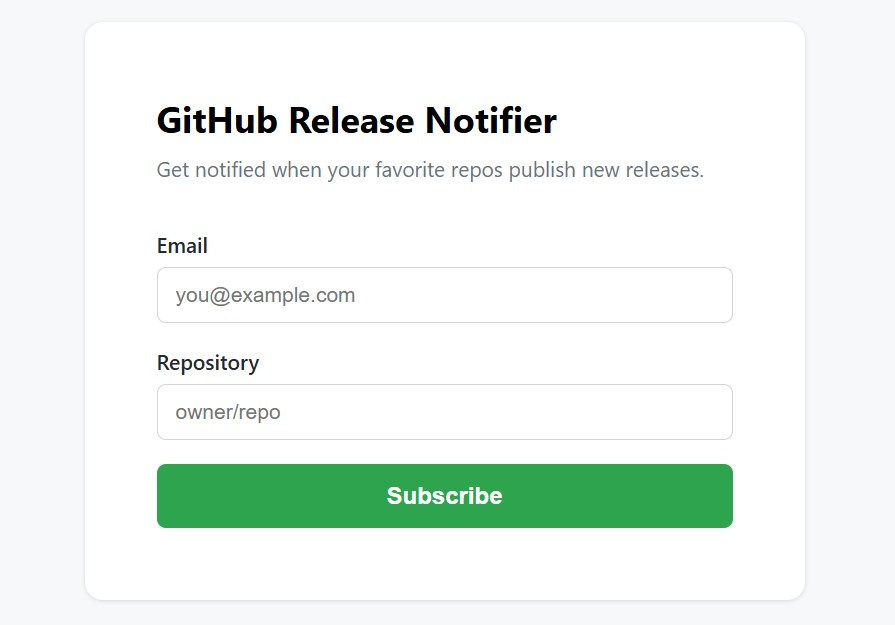

### Confirmation Email

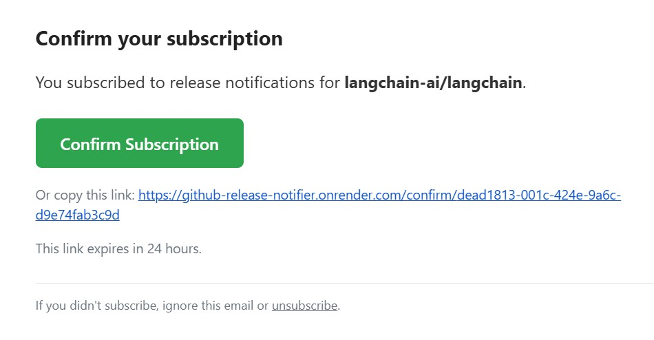

### Confirm Subscription

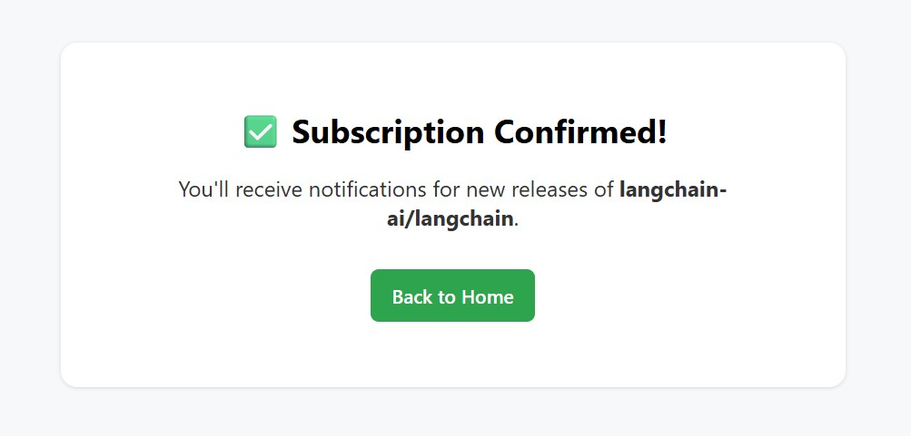

### Unsubscribe

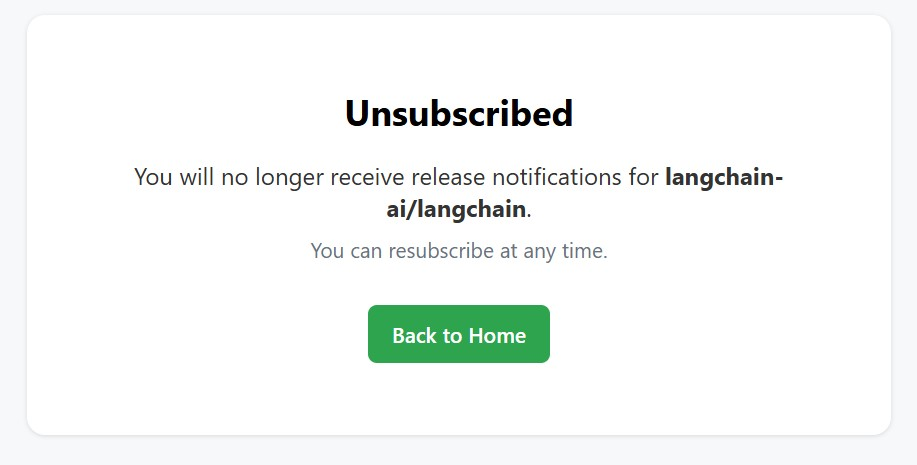

### Release Notification Email

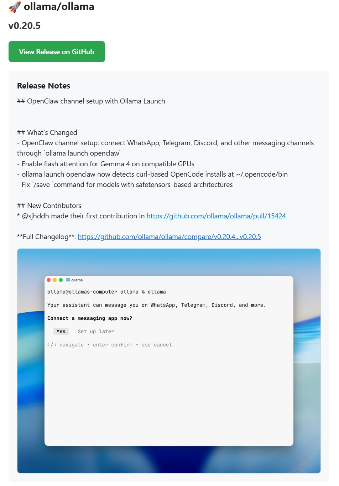

### Swagger UI

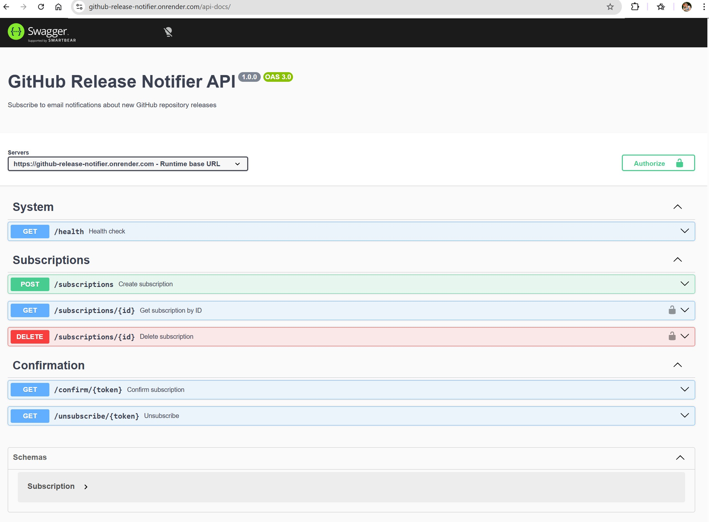

### Prometheus Metrics

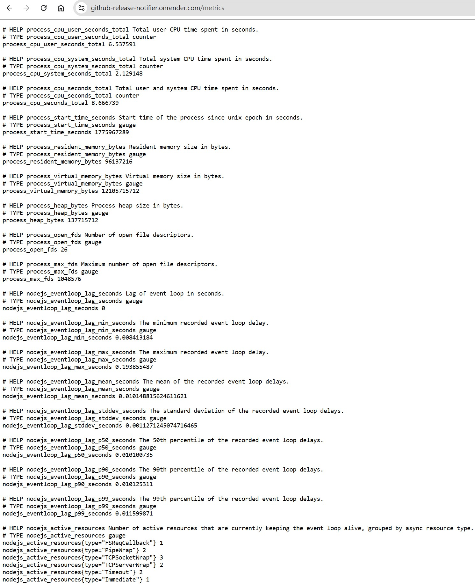

### Docker Compose

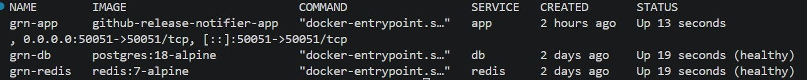

### Render Deployment

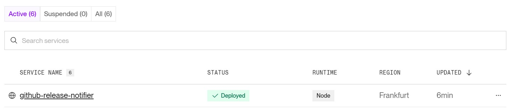

### Render PostgreSQL

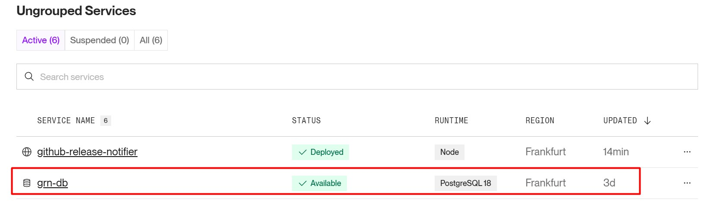

### Upstash Redis

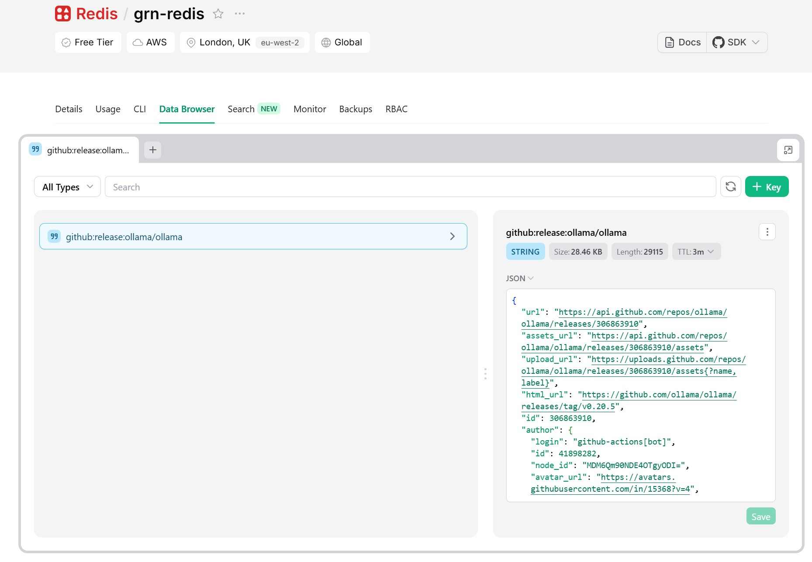

### GitHub Actions CI

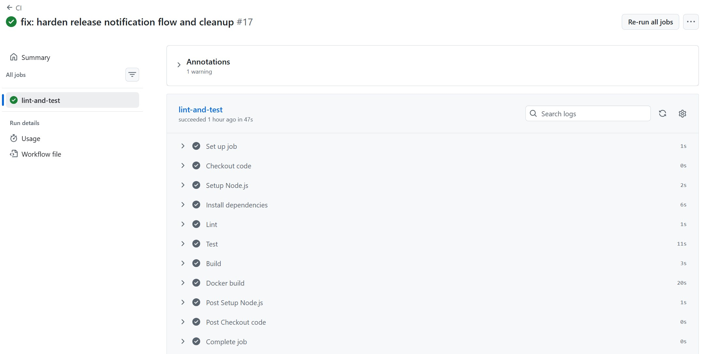
